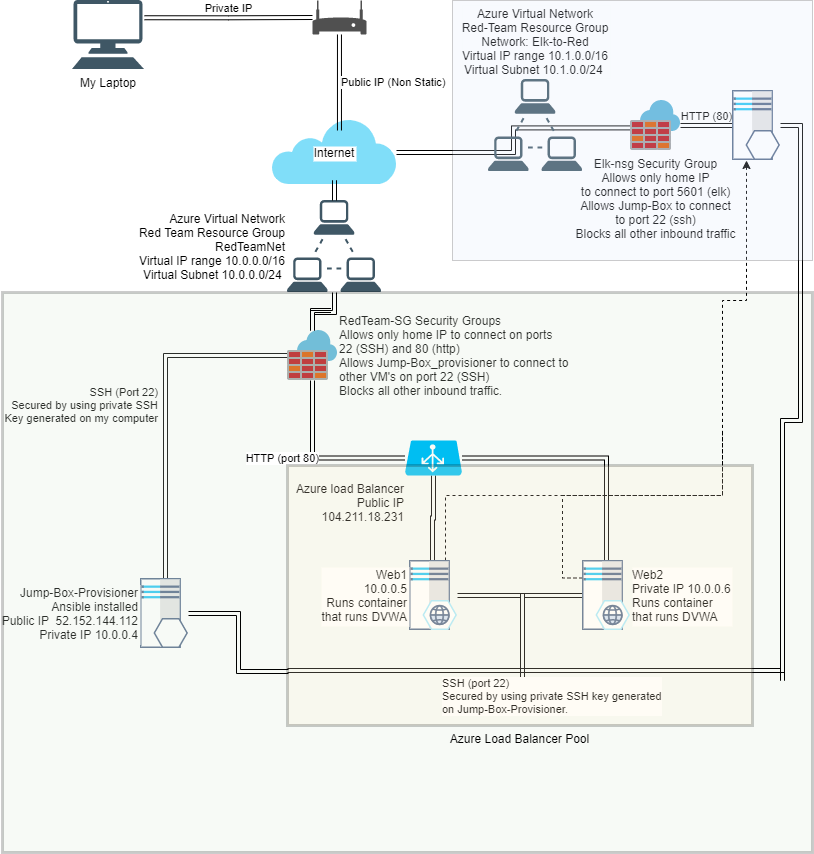

## Automated ELK Stack Deployment

The files in this repository were used to configure the network depicted below.

  

These files have been tested and used to generate a live ELK deployment on Azure. They can be used to either recreate the entire deployment pictured above. Alternatively, select portions of the _____ file may be used to install only certain pieces of it, such as Filebeat.

FileBeat

[Filebeat playbook](https://github.com/shansen18/BootCamp/blob/main/Week13/Scripts/ansible/files/filebeat-playbook.yml)

[Filebeat Config](https://github.com/shansen18/BootCamp/blob/main/Week13/Scripts/ansible/files/filebeat-config.yml)

MetricBeat

[Metricbeat Playbook](https://github.com/shansen18/BootCamp/blob/main/Week13/Scripts/ansible/files/metricbeat-playbook.yml)

[Metricbeat Config](https://github.com/shansen18/BootCamp/blob/main/Week13\Scripts\ansible\files\metricbeat-config.yml)

This document contains the following details:
- Description of the Topology
- Access Policies
- ELK Configuration
  - Beats in Use
  - Machines Being Monitored
- How to Use the Ansible Build

### Description of the Topology

The main purpose of this network is to expose a load-balanced and monitored instance of DVWA, the D*mn Vulnerable Web Application.

Load balancing ensures that the application will be highly available, in addition to restricting unautherized access to the network. I used the load balancer to create a redundancey the protects the DVWA by creating an instance of DVWA on 2 servers, Web1, and Web2, in the same load balancer pool. If one goes down the other instance will take over, thus protecting from a DDOS attack, or any other faults that my bring one server down. 
To access the Web1 and Web2 servers I created a "Jump-Box" which I can only connect to via my home computer using the SSH protocol. I secured the connection between my computer and the jump box, by only allowing inbound traffic from my homes public IP to ports 22 and 80. I further secured port 22 on the jumpbox by creating a new SSH-rsa key and only allowing connection from that SSH key to the jumpbox. Inside the jumpbox I created a docker with it's own SSH-rsa key and shared the key with Web1 and Web2, only allowing SSH access to them from my jump box docker.  

Integrating an ELK server allows users to easily monitor the vulnerable VMs for changes to the logs, files system, system resources, and system services. For the ELK server we installed two beats, Filebeat, and Metricbeat. 

[Information on Filebeat](#Filebeat) 

[Information on Metricbeat](#Metricbeat)

Metricbeat gathers information about the system it is installed on. This includes the system resources and services. Just like file be it send the information to Logstash or Elasticsearch, and from there to Kibana where it can be vizualized. 

The configuration details of each machine may be found below

| Name     | Function | IP Address | Operating System |
|----------|----------|------------|------------------|
| Jump-Box | Gateway  | 10.0.0.4   | Linux            |
| Web1     | DVWA     | 10.0.0.5   | Linux            |
| Web2     | DVWA     | 10.0.0.6   | Linux            |
| Elk      | Elk      | 10.1.0.4   | Linux            |

| Applications Used | Versions      |
|-------------------|---------------|
| Metricbeat        | 7.4.0 (amd64) |
| Filebeat          | 7.4.0 (amd64) |
| Docker            | 20.10.7       |

### Access Policies

The machines on the internal network are not exposed to the public Internet. 

Only the Jump-Box machine can accept connections from the Internet. I can only connect to the Jump-Box via my home computer using the SSH protocol. I secured the connection between my computer and the jump box, by only allowing inbound traffic from my homes public IP to ports 22 and 80. I further secured port 22 on the jumpbox by creating a new SSH-rsa key and only allowing connection from that SSH key to the jumpbox. Inside the jumpbox I created a container with it's own SSH-rsa key and shared the key with Web1 and Web2, only allowing SSH access to them from my jump box docker container.  

The ELK server is in it's own Azure Location (region). This means I had to setup a new network, and security group, for the Elk server, IP range 10.1.0.0/16. I setup a peering connection in order to allow an SSH connection through the Jump-Box. To secure the Elk server I set it's security group to only allow SSH connections from the Jump-Box private IP (10.0.0.4) and only if it was in the container, by entering in the Jump-Box containers SSH-rsa key. 
  
In order for my personal computer to connect to the ELK server, I created a rule that would allow my home IP address to connect to the the Elk server public IP address only on port 5601

A summary of the access policies in place can be found in the table below.

| Name     | Publicly Accessible | Allowed IP Addresses |
|----------|---------------------|----------------------|
| Jump Box | Yes                 | 10.0.0.4, (home IP)  |
| Web1     | No                  | 10.0.0.4             |
| Web2     | No                  | 10.0.0.4             |
| Elk      | Yes                 | 10.0.0.4, (home IP)  |

*Note, I did not note my personal IP. This is done for two reasons. 1. Security, I do not wish to disclose my personal IP address. 2. Because I do not lease a static IP, during the course of this project my personal IP changed several times, so I can't say that it is the same today as when I created the project.

### Elk Configuration

To configure the Elk machine, we used Ansible to automate the configuration. The reason Ansible was advantageous to install the Elk machine is that is automated the install. And in using Ansible we can easily install an program or image on multiple computers in a short amount of time, with the same configuration. 
Using Ansible also gave us a chance to learn a little of YML scripting, and some of the nuances of it, particularly the fact tabs are not allowed for indentation.  

The playbook implements the following tasks:
- Install Docker.io and pip3
- Change VM Memory size of the ELK VM
- Download and Configure the ELK docker container
- Set Ports

The following screenshot displays the result of running `docker ps` after successfully configuring the ELK instance.

### Target Machines & Beats
This ELK server is configured to monitor the following machines:
- Web1 (10.0.0.5)
- Web2 (10.0.0.6)

We have installed the following Beats on these machines, these Beats allow us to collect the following information from each machine:

#### Metricbeat
- Metricbeat gathers information about the system it is installed on. This includes the system resources and services. Just like file be it send the information to Logstash or Elasticsearch, and from there to Kibana where it can be vizualized

#### Filebeat
- Filebeat gathers information about the file system, and logs which files have changed and when. It then sends this information to be processed in Logstash or into Elasticsearch for indexing. From there Kibana is used to visualize the data.

### Using the Playbook
In order to use the playbook, you will need to have an Ansible control node already configured. Assuming you have such a control node provisioned: 

SSH into the control node and follow the steps below:

-Copy the [filebeat.yml](https://github.com/shansen18/BootCamp/blob/e231fbf7ce9d53a5f3466c8d9b5205b03cbb63ec/Week13/Scripts/ansible/files/filebeat-playbook.yml) and [metricbeat.yml](https://github.com/shansen18/BootCamp/blob/e231fbf7ce9d53a5f3466c8d9b5205b03cbb63ec/Week13/Scripts/ansible/files/metricbeat-playbook.yml) file to the /etc/ansible/roles/files/ directory.

-Update the configuration files to include the Private IP of the Elk-Server to the ElasticSearch and Kibana sections of the configuration file.

-Update the configuration files, and start the service for both Filebeat and Metricbeat.

Run the playbook, and navigate to ELk-Server to check that the installation worked as expected. [docker ps]

Which file is the playbook? Where do you copy it? The playbook is called filebeat-playbook.yml. You copy the file to the "/etc/ansible/hosts/" directory.
_TODO: Answer the following questions to fill in the blanks:_
- _Which file is the playbook? Where do you copy it?_
- _Which file do you update to make Ansible run the playbook on a specific machine? How do I specify which machine to install the ELK server on versus which to install Filebeat on?_
- _Which URL do you navigate to in order to check that the ELK server is running?

_As a **Bonus**, provide the specific commands the user will need to run to download the playbook, update the files, etc._
